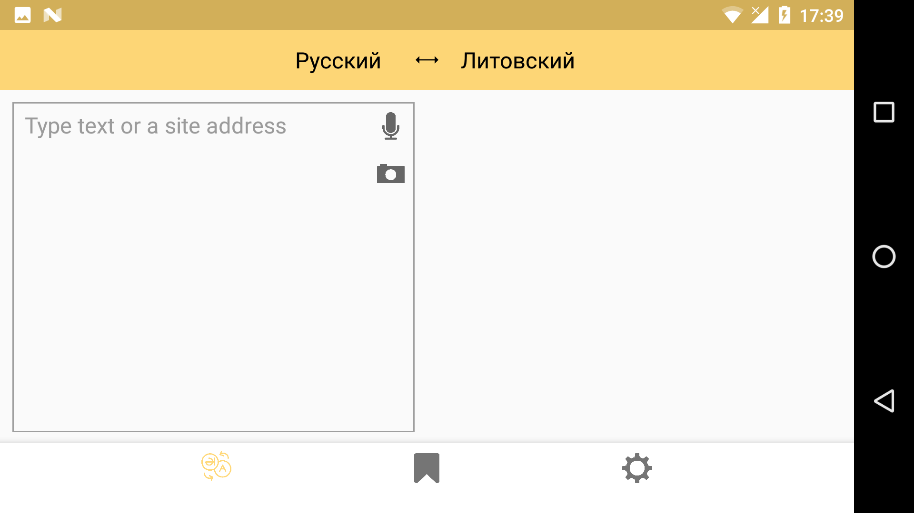
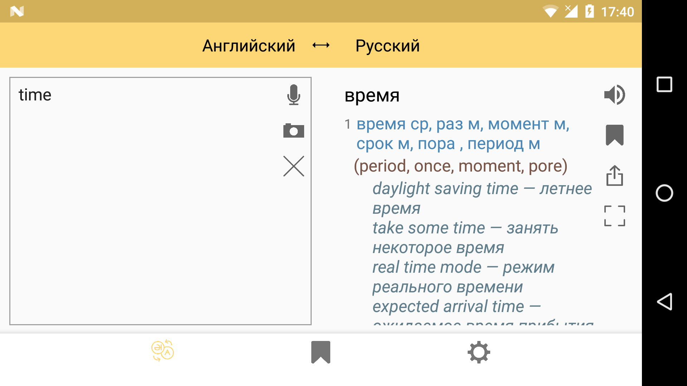
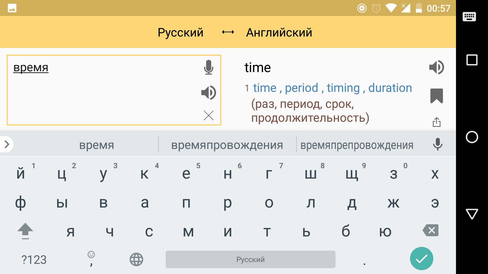
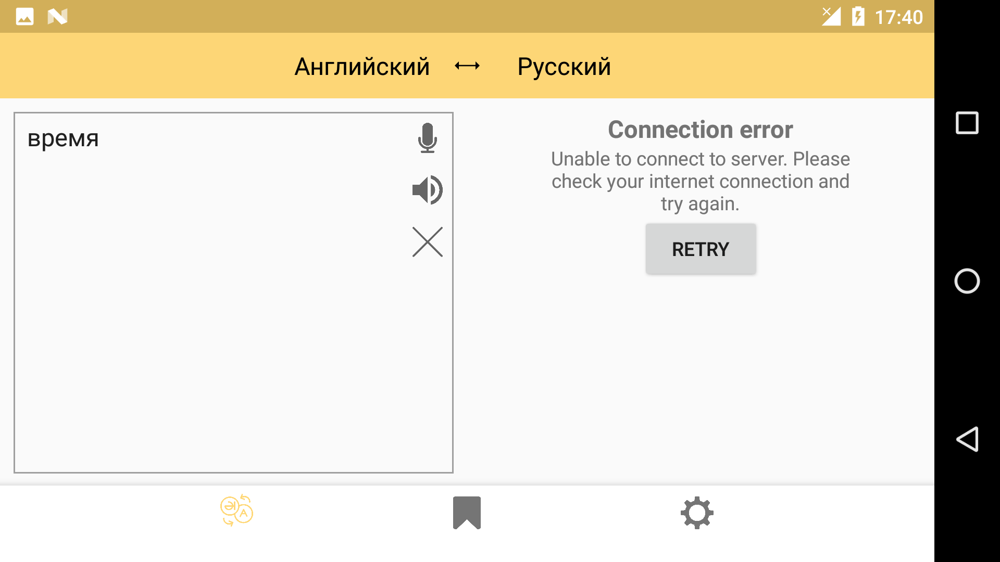
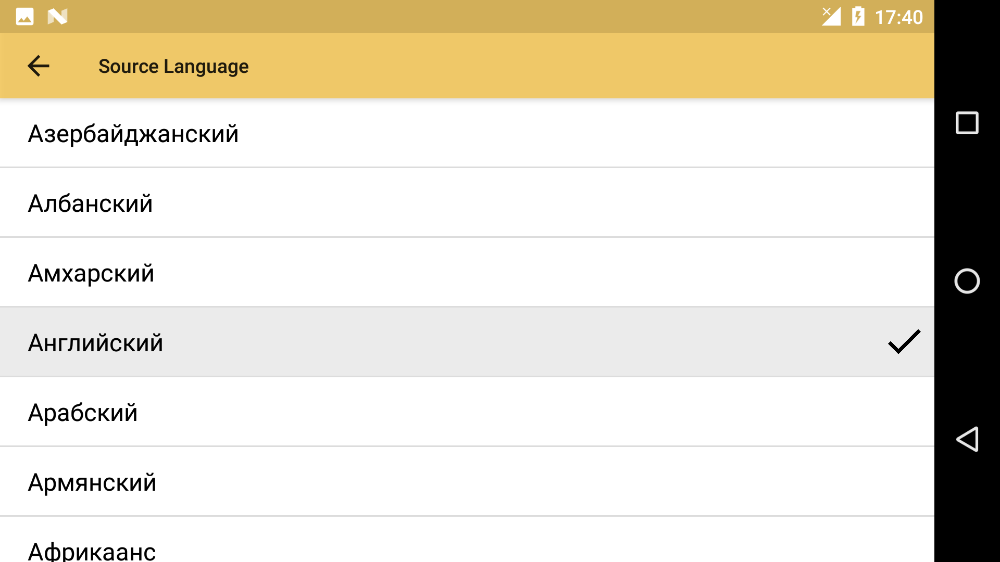
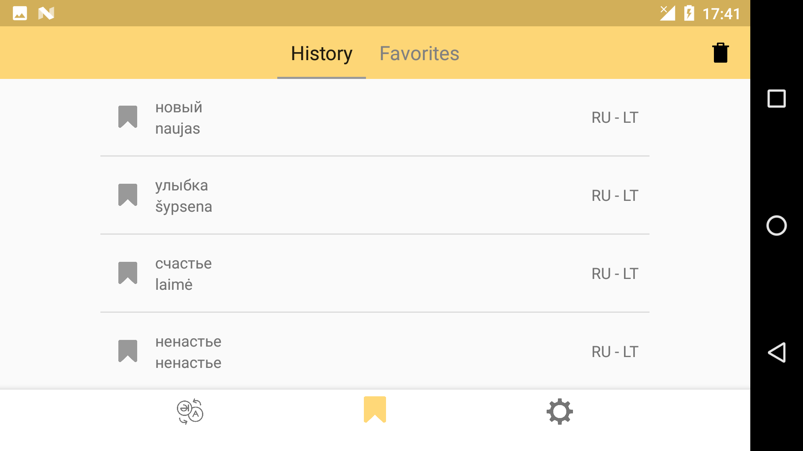
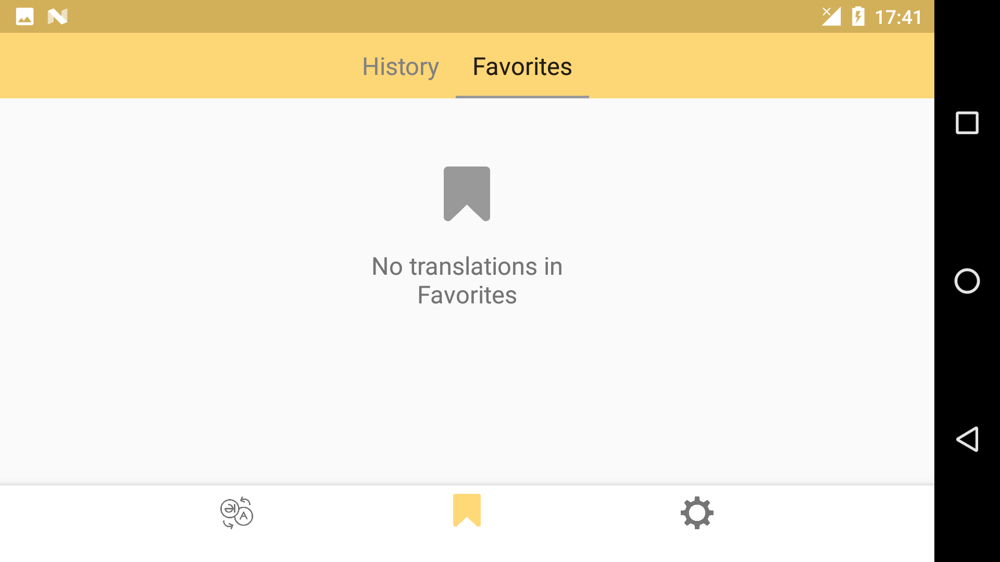
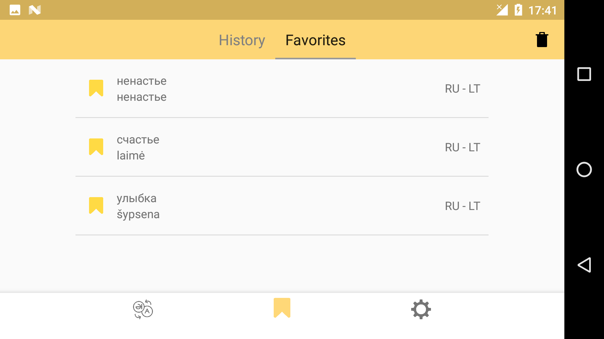

# Translator

## Getting Started:
1. Get API key on [Yandex.Dictionary](https://yandex.com/dev/dictionary/) -> enter API key in `local.properties`: `YANDEX_DICTIONARY_API_KEY_PROD=<your_api_key>`
2. Get API key on [Yandex.Translate](https://yandex.com/dev/translate) -> enter API key in `local.properties`: `YANDEX_TRANSLATE_API_KEY_PROD=<your_api_key>`
3. Compile & Run project

## Architecture & refactoring:
same as at [MusicPlayer section](https://github.com/code-n-roll/MusicPlayer#architecture--refactoring-wip)

## Portrait views:

## Landscape views:

## OS requirements and limitations:
same as [MusicPlayer section](https://github.com/code-n-roll/MusicPlayer/blob/master/README.md#os-requirements-and-limitations)
